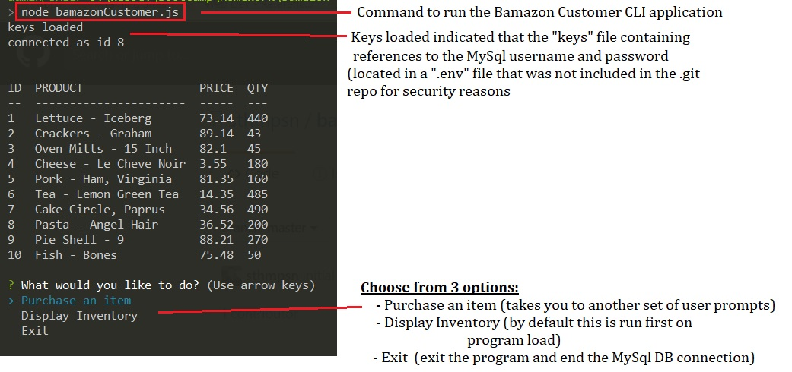
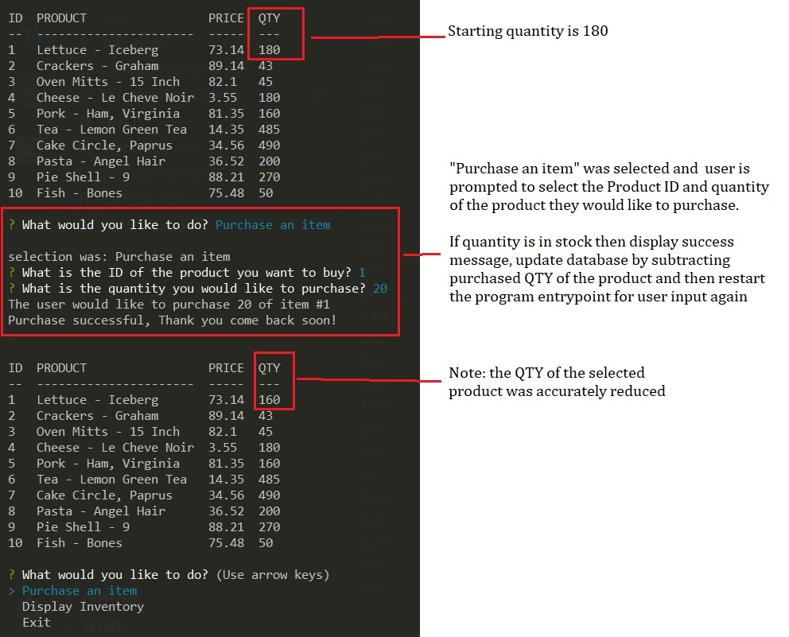
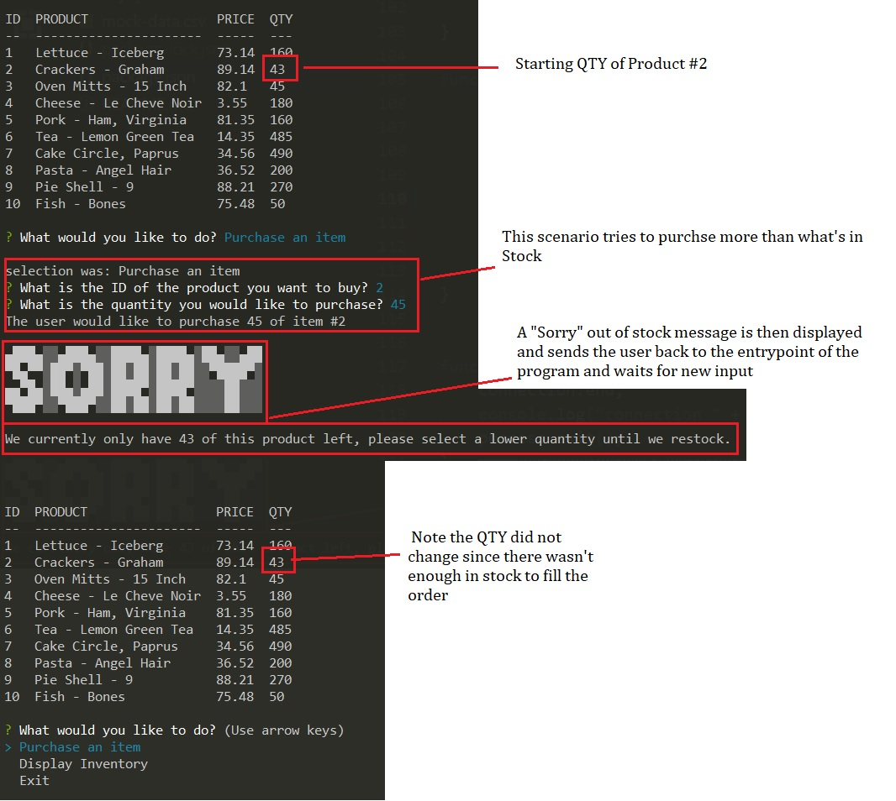
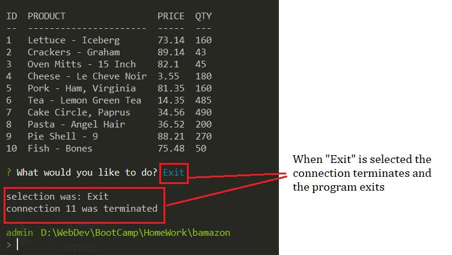

# BAMazon

# Running the Program 

1) Clone the repo locally and run
2) Open a command prompt or bash shell 
3) Run "npm install" to install all required packages listed in the "package.json" file
4) Create a new file in the root called ".env" and add your MySQL username and password info:
        UN=<username>
        PW=<password>

4) Back at the command prompt or bash sheel run "node bamazonCustomer.js"

# Using the Program
* Use the screenshots located in the "screenshots" folder for more info on how to use the CLI

# Screenshots
## Run Program

## Purchase Item

## Purchase Out of Stock

## Exit

